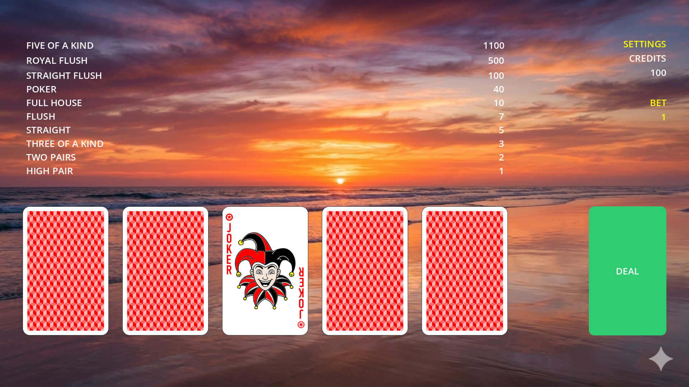
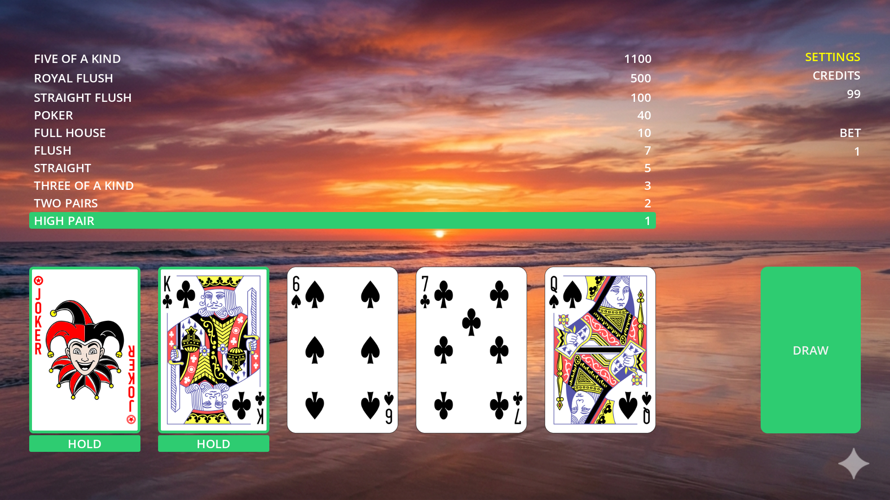
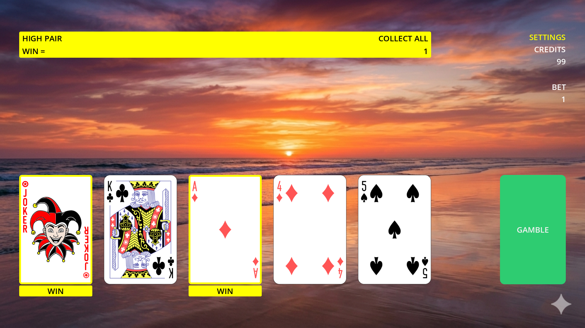

## Poker Double or Nothing

About This Game

Poker Double or Nothing is game where you try to get winning combination after draw, and then double it by guessing if the next card will be high (8,9,10,J,Q,K) or low (1,2,3,4,5,6).

Open Source & Steam Version

This game is open source and published under the BSD 2-Clause license. The base source code will be available for download on our official repository starting on the day of the game's launch. Please note that this source code will not include specific Steam enhancements, such as platform-specific integrations or Steamworks SDK features.

Community Graphics Packs

The game supports custom community-created graphics packs, including cards and wallpapers. Many of these packs are developed by the community under LGPL or GPL licenses and are hosted on external sites; therefore, they are not distributed with the game on Steam.

To find community graphics packs or more information about the source code, please visit the External Links section on the right side of this page.

community-created graphics packs: https://github.com/dbojan/cards

steam link: https://store.steampowered.com/app/4701190/

2026-03-06-1
- added save
